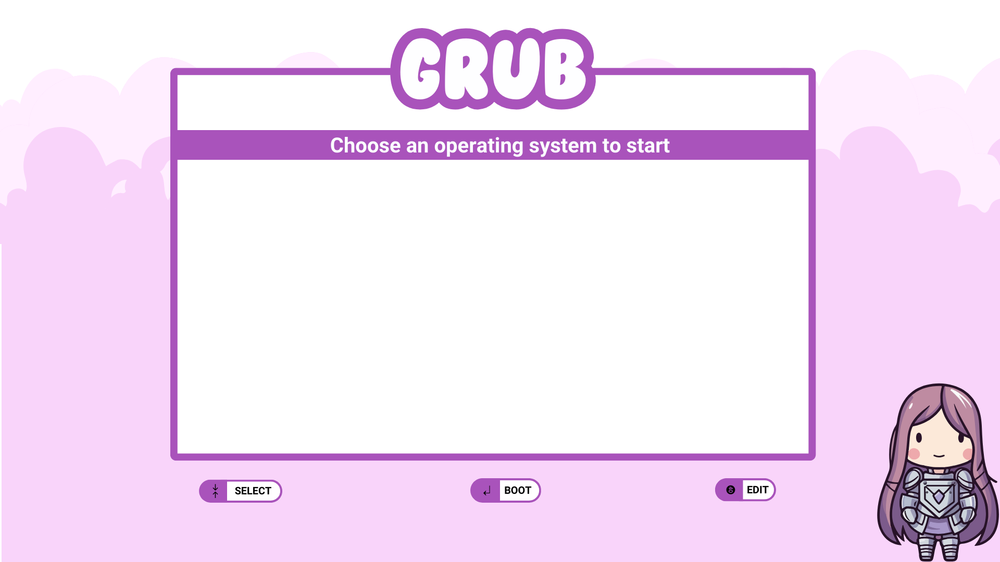
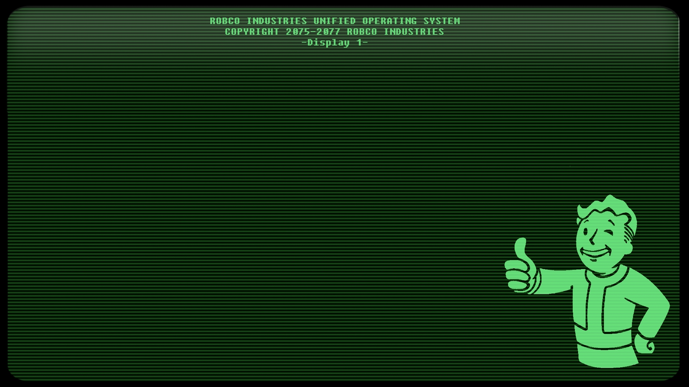
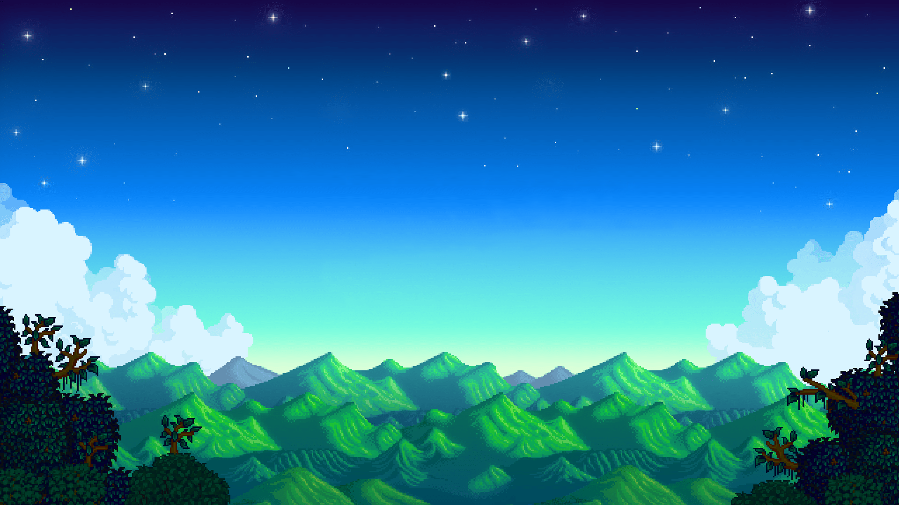

# ⚠️ **VARNING**

<strong>Dessa script körs helt på egen risk!</strong>  
Jag tar inget ansvar för eventuella skador, instabilitet eller dataförlust som kan uppstå.

> **Viktigt:** Använd endast dessa script om du vet vad du gör

 🎨 GRUB Tema 

### Cartoon Girl -- [Source](https://github.com/MrVivekRajan/Grub-Themes)

### Aesthetic  -- [Source](https://github.com/MrVivekRajan/Grub-Themes)

### Fallout -- [Source](https://github.com/shvchk/fallout-grub-theme)

### Stardew Valley -- [Source](https://www.gnome-look.org/p/2327364)

🎨 Fastfetch Tema

### Non-binary flagga

### Transgender flagga  

🎨 Starship Tema

### Non-binary flagga

### Transgender flagga  

## 🐼 [Panda] 
## 😺 [Katt] 
## 🐧 [Pingvin] 
## 🦄 [Enhörning] 
## 🦊 [Räv] 
## 🦉 [Ugla] 
## 🐝 [bi] 
## 🍍 [Ananas]

